# CTI Research Lab

**Analyst:** Millie Altman 


**Classification:** UNCLASSIFIED // FOR PORTFOLIO USE  
**Environment Type:** Purple Team Research Lab  
**Frameworks:** MITRE ATT&CK | Diamond Model  
**Status:** Active  

---

## Contents

- [Lab Environment](#lab-environment)
- [Phase 1 — Foundation & Telemetry](#phase-1--foundation--telemetry-infrastructure)
- [Phase 2 — Passive Detection](#phase-2--passive-detection-operations)
- [Phase 3 — Active Adversary Emulation](#phase-3--active-adversary-emulation)
- [Detection Coverage Summary](#detection-coverage-summary)
- [Planned Research](#planned-research)
 
---

## Overview

A controlled purple team research environment designed to emulate documented adversary techniques, validate detection capabilities, and produce actionable intelligence findings. The lab operates across three functional phases — infrastructure and telemetry foundation, passive detection operations, and active adversary emulation — each building on the previous to support end-to-end threat analysis from initial access through forensic investigation.

All exercises are ATT&CK-mapped, evidence-documented, and analytically contextualized. Findings feed directly into finished intelligence products and threat actor profiles maintained in the broader portfolio.

---

## Lab Environment

| Component | Role |
|---|---|
| VMware Workstation (NAT) | Isolated hypervisor environment |
| Wazuh (Manager + Indexer + Dashboard) | SIEM — log aggregation, alert engine, threat hunting |
| Windows 10 Pro + Sysmon | Victim endpoint — granular process and network telemetry |
| Kali Linux 2026.x | Adversary node — attack simulation and reconnaissance |
| Atomic Red Team | ATT&CK-mapped adversary technique emulation framework |
| AbuseIPDB API | Threat intelligence enrichment — IP reputation lookups |

**Design note:** Wazuh agents are deployed on both the victim and adversary nodes. This purple team configuration captures the full attack lifecycle — attacker actions and victim telemetry — within a single SIEM view.

---

## Phase 1 — Foundation & Telemetry Infrastructure

### Objective
Establish a stable, isolated research environment with endpoint telemetry collection capable of supporting adversary emulation and forensic analysis.

### Work Completed

**SIEM Deployment**  
Deployed Wazuh via OVA on a VMware NAT network. Enrolled Windows 10 Pro as a monitored endpoint and confirmed agent active status in the Wazuh dashboard.

**Endpoint Telemetry — Sysmon**  
Installed Sysmon 64 with network monitoring enabled. Configured the Windows Wazuh agent to ingest the `Microsoft-Windows-Sysmon/Operational` event channel — extending telemetry beyond standard Windows Event Logs to capture:
- EID 1 — Process creation with full command-line arguments
- EID 3 — Network connections with source/destination metadata
- EID 5 — Process termination

**File Integrity Monitoring**  
Configured real-time FIM on a custom monitored directory (`C:\lab_monitor`). Validated alert generation for file creation, modification, and deletion events within seconds of activity.

**Adversary Node Integration**  
Deployed Kali Linux 2026.x as a controlled adversary node. Diagnosed and resolved a DHCP subnet mismatch splitting assets across two network ranges — migrated all virtual adapters to a unified VMnet8 NAT segment and updated agent configurations. Enrolled Kali as a Wazuh agent for purple team telemetry coverage.

**Network Validation**  
Created a scoped ICMPv4 inbound firewall rule (`Allow_Lab_Ping`) on the Windows endpoint to permit controlled bi-directional communication within the lab subnet. Confirmed tri-node connectivity.

| Evidence | |
|---|---|
| Custom firewall rule (ICMPv4, subnet-scoped) | 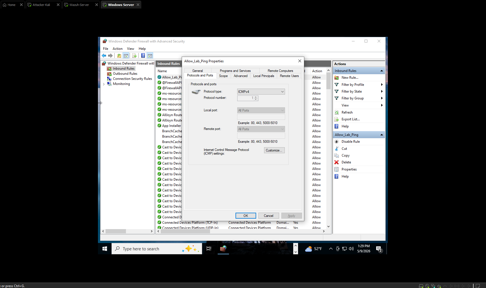 |
| Wazuh — both agents active simultaneously | 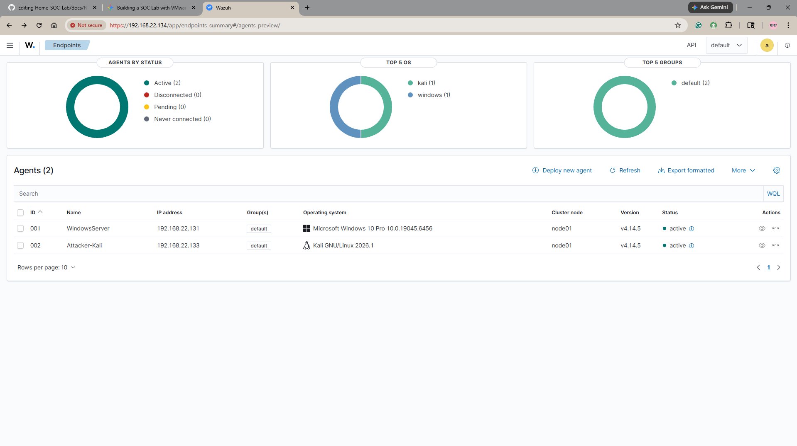 |
| Ping confirmation — Kali to Windows | 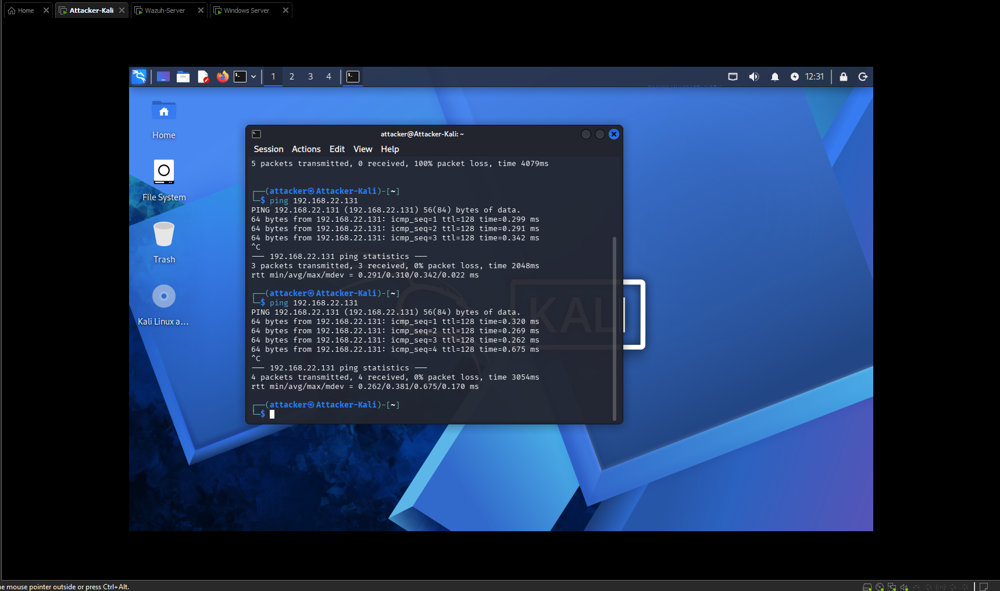 |
| Ping confirmation — Windows to Kali | 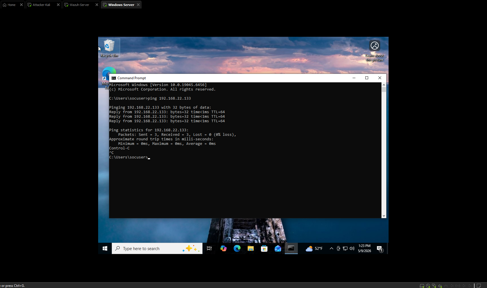 |
| ossec.conf — Sysmon channel configuration | 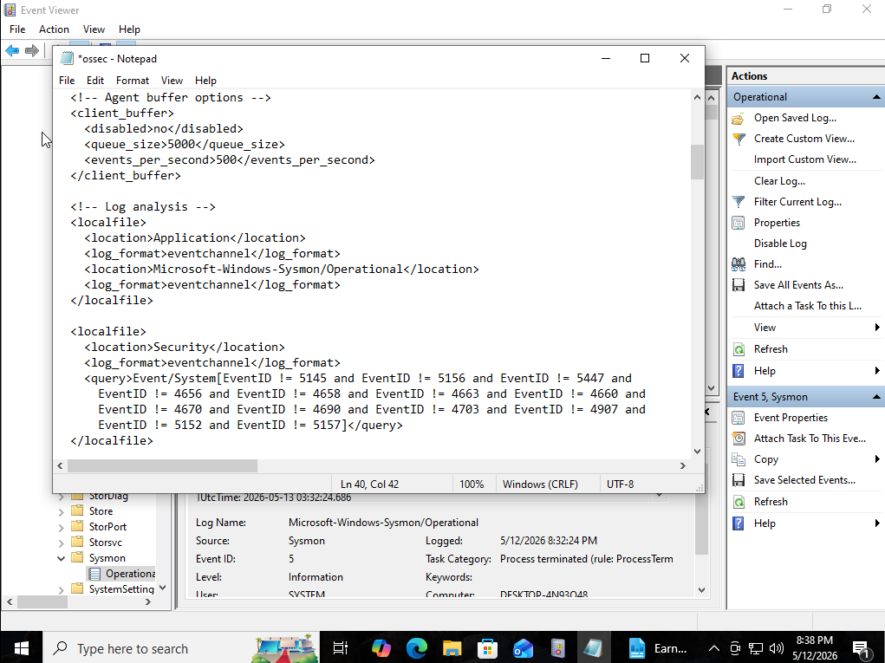 |
| Sysmon telemetry confirmed in Wazuh | 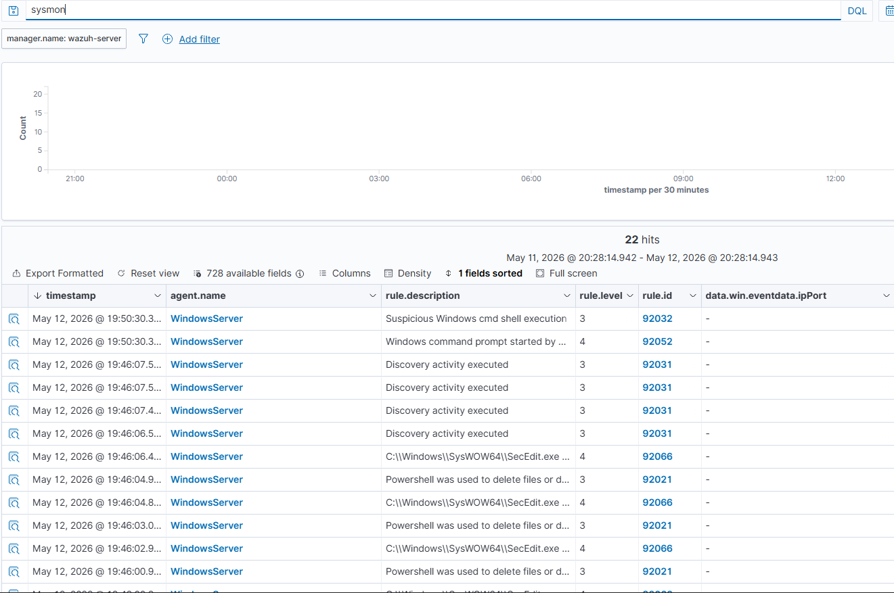 |

Full documentation: [`docs/Day1_Foundation.md`](./docs/day1-foundation.md) | [`docs/Day2_Attacker_Setup.md`](./docs/day2-attacker-setup.md)

---

## Phase 2 — Passive Detection Operations

### Objective
Validate the detection pipeline against realistic adversary activity without active emulation — establishing a baseline for what the SIEM detects, at what fidelity, and under what conditions.

### Exercise 2.1 — Reconnaissance Detection (T1046)

**Method:** Executed an aggressive Nmap scan (`nmap -A -T4`) from the Kali adversary node against the Windows endpoint.

**Firewall result:** All 1000 scanned ports returned Filtered — host-based perimeter controls successfully dropped unsolicited inbound traffic.

**SIEM result:** Wazuh independently detected the reconnaissance attempt, generating the following alerts:

| Rule | Description |
|---|---|
| 92031 | Discovery activity executed — Nmap Scripting Engine detected |
| 92032 | Suspicious Windows cmd shell execution |
| Sysmon EID 3 | Network connections from Kali IP captured in process telemetry |

**Analytical finding:** Defense-in-depth validated. The firewall blocked access; the SIEM detected intent. An analyst relying solely on firewall block logs would have no visibility into the Nmap NSE activity. Layered telemetry is a detection requirement, not an enhancement.

| Evidence | |
|---|---|
| Nmap terminal — all ports filtered | 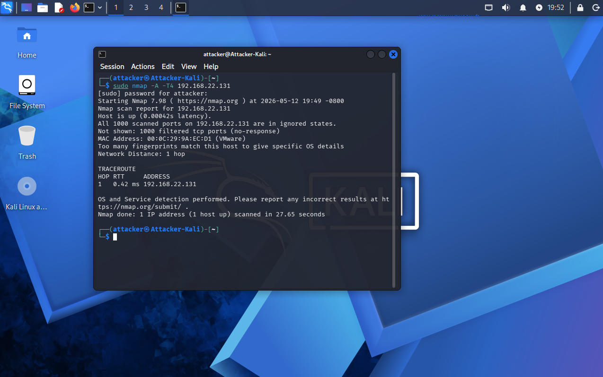 |
| Wazuh — Rules 92031 and 92032 | 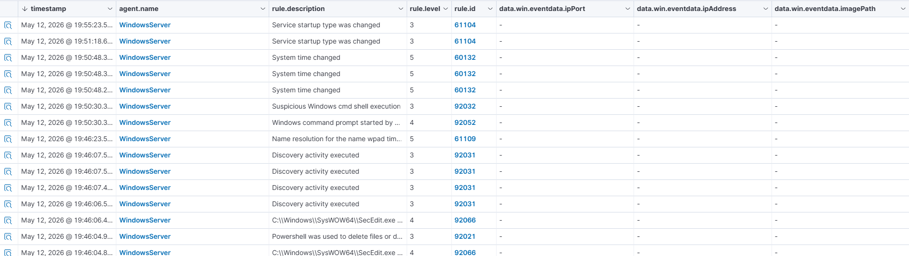 |

Full documentation: [`docs/Day3_Detection_Operations.md`](./docs/day3-detection-operations.md)

---

## Phase 3 — Active Adversary Emulation

### Objective
Emulate documented adversary techniques using Atomic Red Team, analyze resulting telemetry in Wazuh, and develop custom detection logic to address identified gaps. All exercises are mapped to MITRE ATT&CK and contextualized against real threat actor reporting.

---

### Exercise 3.1 — Persistence Emulation (T1053.005)

**Technique:** Scheduled Task/Job: Scheduled Task  
**Threat Actor Context:** APT29 used `schtasks.exe` during the SolarWinds compromise to establish SUNSPOT persistence across reboots — a documented technique in MITRE ATT&CK group reporting.

**Execution:**
```powershell
Invoke-AtomicTest T1053.005 -TestNumbers 1
```

**Outcome:** Two scheduled persistence tasks successfully created — `T1053_005_OnLogon` (executes at user logon) and `T1053_005_OnStartup` (executes at system startup).

**Forensic analysis:** Queried Wazuh Threat Hunting for the preceding 15-minute window and recovered the Sysmon EID 1 process creation event showing `cmd.exe` spawning `schtasks.exe`. The raw JSON payload captured the full command-line arguments used to register both tasks, including triggers and actions, providing a complete forensic reconstruction of the persistence mechanism.

**Key artifacts recovered:**

| Field | Value |
|---|---|
| `data.win.eventdata.image` | `C:\\Windows\\System32\\schtasks.exe` |
| `data.win.eventdata.parentImage` | `C:\\Windows\\System32\\cmd.exe` |
| `data.win.eventdata.commandLine` | Full `schtasks /create` command with task names and triggers |

**Remediation:** `Invoke-AtomicTest T1053.005 -TestNumbers 1 -Cleanup` — tasks evicted, endpoint returned to verified baseline.

| Evidence | |
|---|---|
| Atomic Red Team — install and T1053.005 test enumeration | 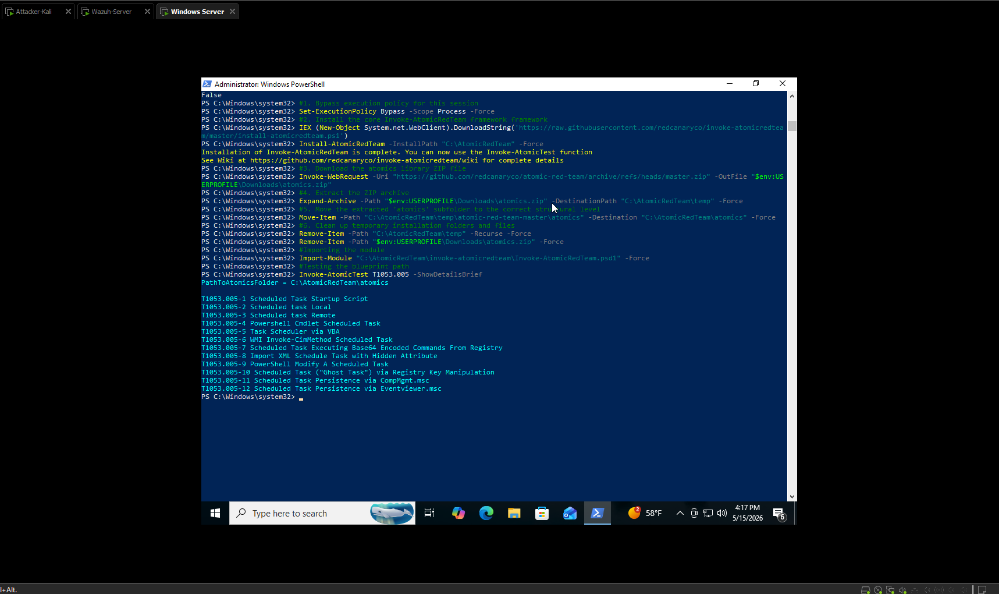 |
| Task creation confirmed — both tasks in Ready state | 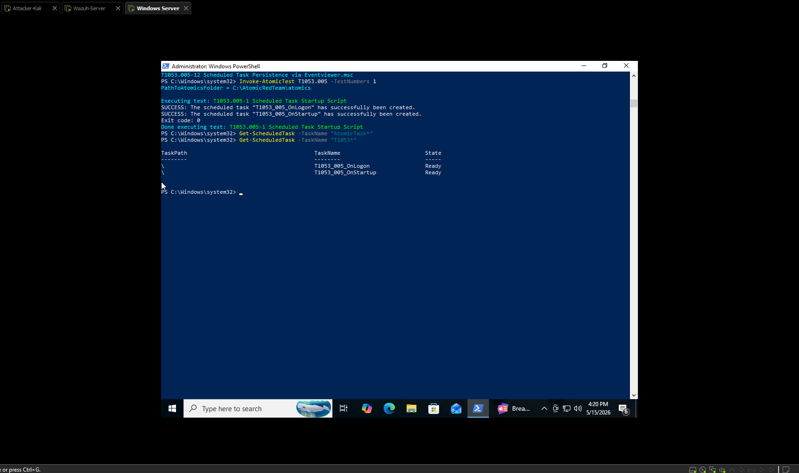 |
| Wazuh JSON — schtasks.exe process tree and full cmdline | 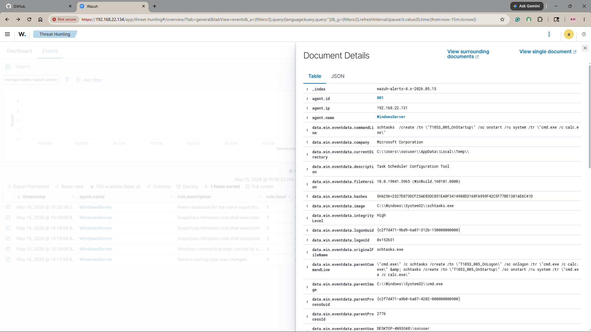 |
| Cleanup — persistence tasks evicted | 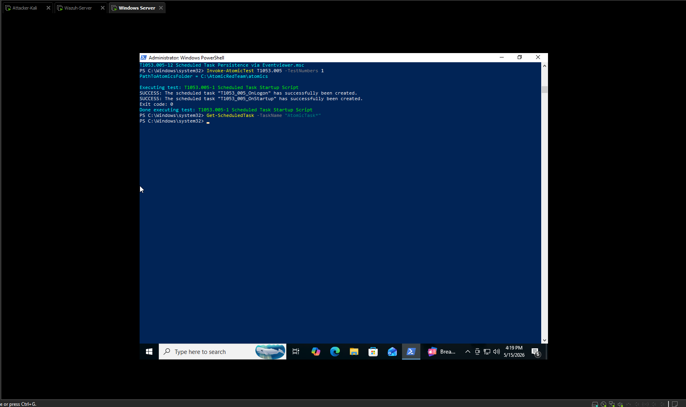 |

Full documentation: [`docs/Day4_Adversary_Simulation.md`](./docs/day4-adversary-simulation.md)

---

### Exercise 3.2 — Custom Detection Rule Engineering (T1059.001)

**Objective:** Engineer a custom Wazuh detection rule that correlates live Sysmon telemetry against a local threat intelligence indicator database — closing a detection gap not addressed by any default rule.

#### Threat Intelligence Database

Created a Wazuh CDB List containing a file indicator attributed to a simulated APT29 campaign:

```
/var/ossec/etc/lists/custom-intel-blacklist
malicious_script.ps1:APT29_Campaign
```

Registered the list in `ossec.conf` under the ruleset block for active memory lookup during rule evaluation.

#### Rule Development

**Final rule — `local_rules.xml`:**

```xml
<rule id="100050" level="12">
  <if_sid>92029</if_sid>
  <field name="win.eventdata.commandLine" type="pcre2">(?i)malicious_script\.ps1</field>
  <description>CTI Match: System Log Contains Known Malicious Indicator</description>
  <mitre>
    <id>T1059.001</id>
  </mitre>
</rule>
```

**Design rationale:**  
`<if_sid>92029</if_sid>` scopes the rule to Sysmon process creation events — required for the Wazuh parser to access the `win.eventdata` field tree. PCRE2 case-insensitive matching on the command-line field provides reliable detection against real-world payload variations without dependency on exact string formatting.

#### Engineering Iterations

Three configurations were tested before Rule 100050 fired correctly. Each failure surfaced a specific constraint in Wazuh's log parsing architecture:

| Iteration | Approach | Result | Root Cause |
|---|---|---|---|
| 1 | `<match>` tag — broad string scan | Rule never fired | `<match>` scans the raw syslog header only; Sysmon stores command-line data in nested field objects inaccessible to this tag |
| 2 | `<category>ossec</category>` + field targeting | Manager parse failure | Without an explicit `<if_sid>` parent rule dependency, the engine cannot resolve the `win.eventdata` field tree |
| 3 | `lookup="match_key_value"` against CDB list | Silent lookup failure | Trailing whitespace mismatch between the Windows event payload string and the flat CDB text format |

| Evidence | |
|---|---|
| CDB list — threat indicator database | 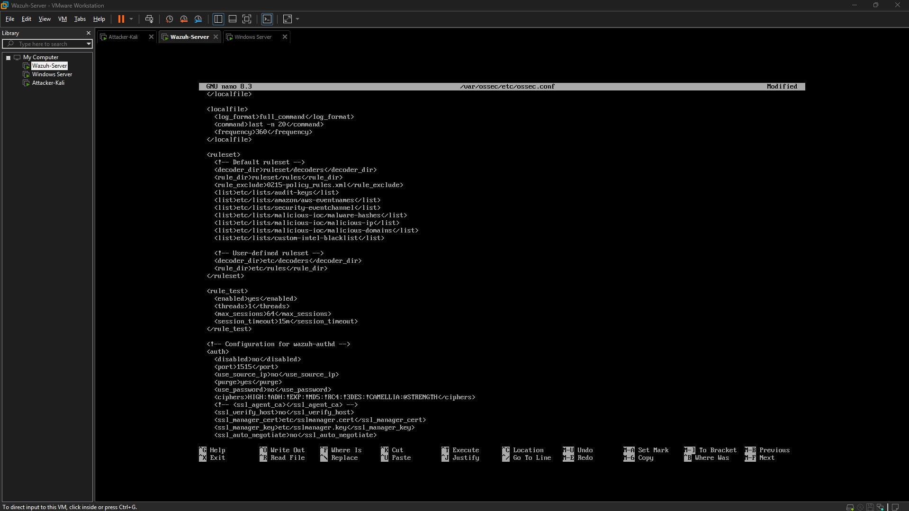 |
| ossec.conf — list registered in ruleset | 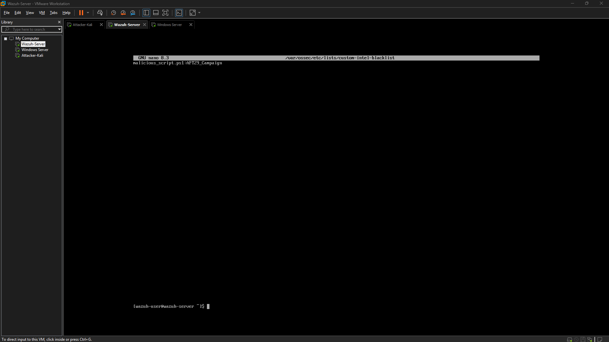 |
| local_rules.xml — Rule 100050 | 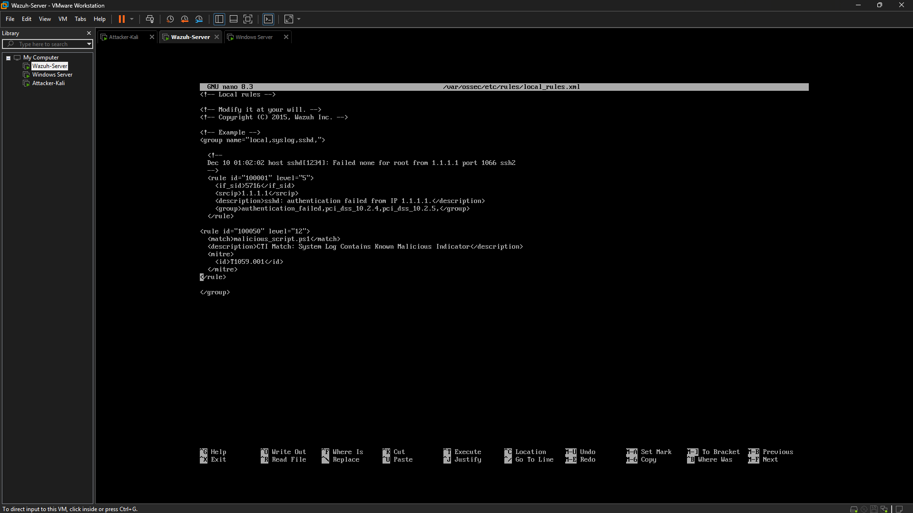 |
| Iteration 1 error — match tag | 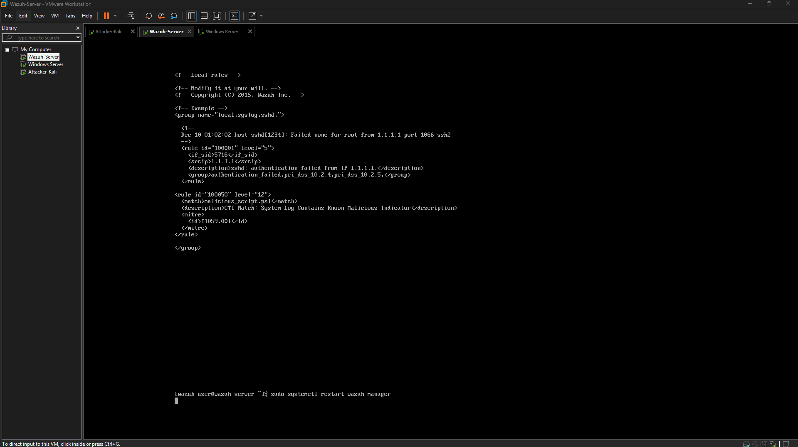 |
| Iteration 2 error — category incompatibility |  |
| Iteration 3 error — lookup syntax | 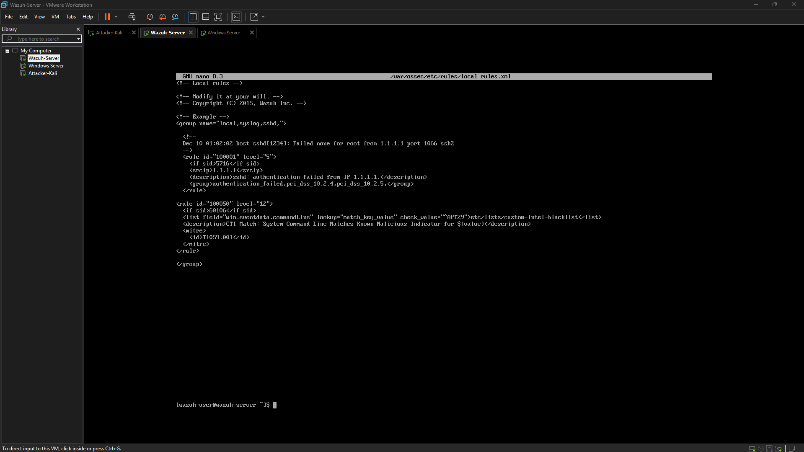 |

#### Operational Validation

Executed the blacklisted indicator on the Windows endpoint:

```powershell
Write-Output "Write-Host 'Running campaign checks...'" > C:\Windows\Temp\malicious_script.ps1
powershell.exe -ExecutionPolicy Bypass -File C:\Windows\Temp\malicious_script.ps1
```

**Result:** Rule 100050 fired — Level 12 High Severity alert generated with MITRE T1059.001 mapping confirmed.

| Evidence | |
|---|---|
| PowerShell execution of blacklisted indicator | 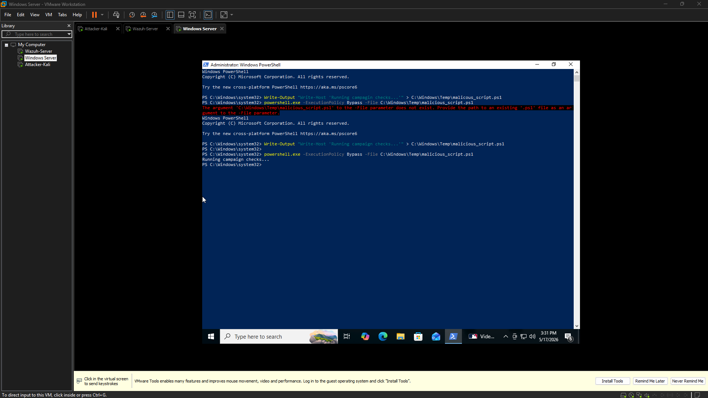 |
| Wazuh — Rule 100050, Level 12, confirmed detection | 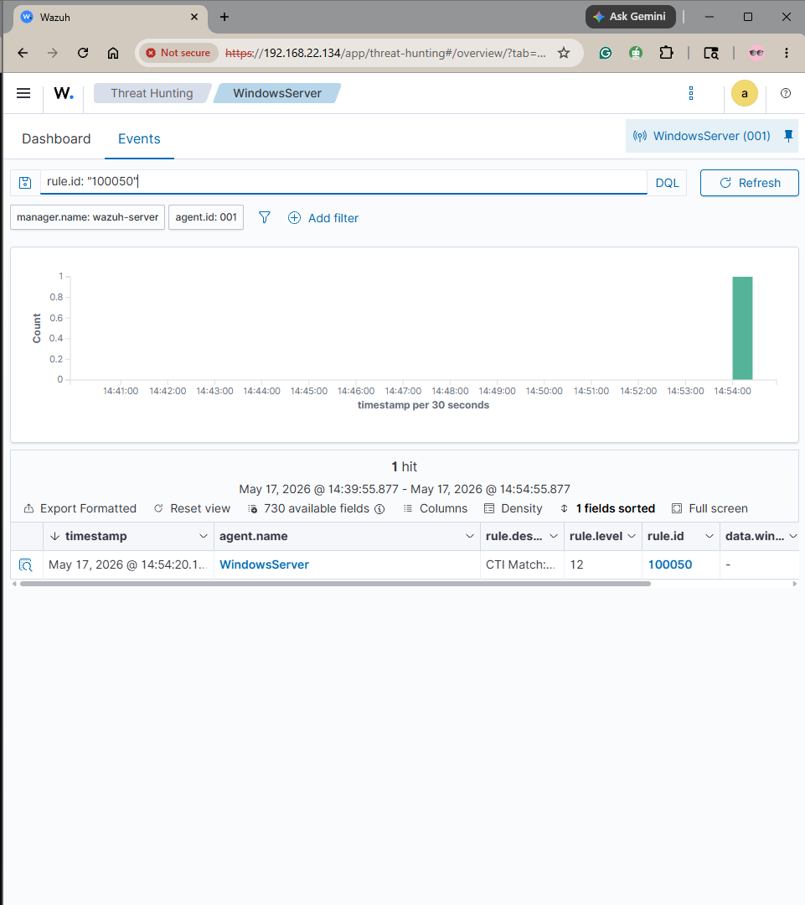 |

Full documentation: [`docs/Day5_Threat_Intelligence_Enrichment.md`](./docs/day5-threat-intelligence-enrichment.md)

---

### Exercise 3.3 — CTI Analysis & Adversary Profiling

**Objective:** Correlate lab telemetry against open-source intelligence, construct an adversary profile, and map detection coverage using ATT&CK Navigator.

#### Forensic Analysis

| Artifact | Analyst Assessment |
|---|---|
| Binary: `powershell.exe` | Living-off-the-land execution — native utility produces no malware signature; evades signature-based detection (T1059.001) |
| Flags: `-ExecutionPolicy Bypass -File` | Deliberate subversion of Windows script execution policy — consistent with unsigned or untrusted payload staging |
| Path: `C:\Windows\Temp\` | Volatile directory execution — high-confidence indicator of post-exploitation staging activity |

#### OSINT Correlation — APT29

Cross-referenced lab-observed indicators against MITRE ATT&CK APT29 group documentation:

- **T1059.001:** APT29 uses encoded PowerShell to unpack secondary payloads (CozyCar, SeaDuke) and bypass execution controls — consistent with observed execution flags and path
- **T1053.005:** APT29 used `schtasks.exe` during the SolarWinds compromise to establish SUNSPOT persistence — consistent with Exercise 3.1 emulation

#### ATT&CK Navigator Coverage

ATT&CK Navigator layer constructed to visualize validated detection coverage against emulated techniques and identify gaps requiring additional rule engineering.

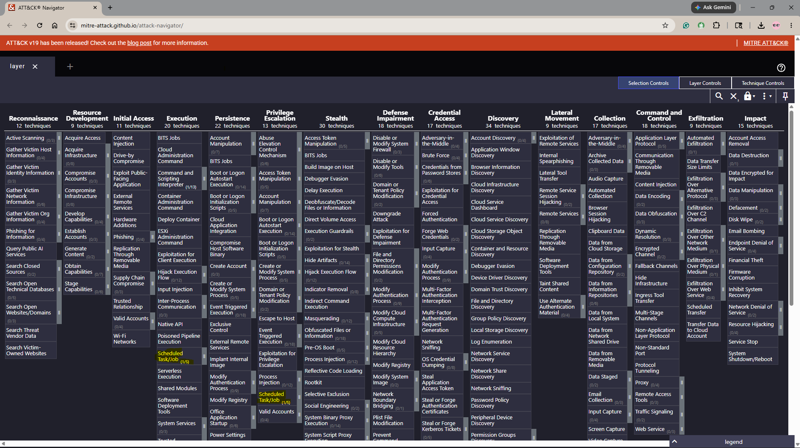

#### Diamond Model

```
           [ ADVERSARY ]
              (APT29)
             /        \
            /          \
  [ CAPABILITY ]——[ INFRASTRUCTURE ]
  (T1059.001           (C:\Windows\Temp\
   T1053.005)           staging path)
            \          /
             \        /
            [ VICTIM ]
         (Windows endpoint)
```

| Evidence | |
|---|---|
| MITRE ATT&CK — APT29 T1059.001 | 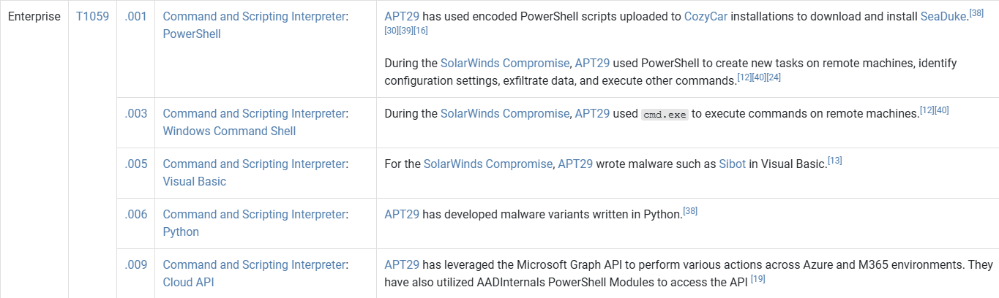 |
| MITRE ATT&CK — APT29 T1053.005 | 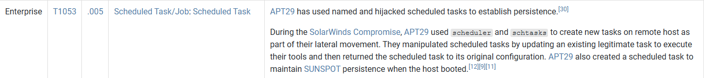 |
| Wazuh — Rule 100050 forensic telemetry | 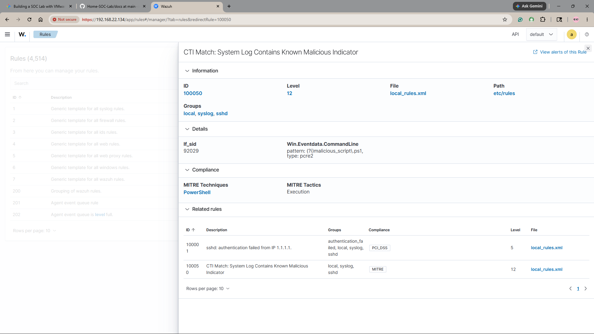 |

Full documentation: [`docs/Day6_Adversary_Profiling_OSINT.md`](./docs/day6-adversary-profiling_OSINT.md)

---

## Detection Coverage Summary

| Technique | ATT&CK ID | Detected | Detection Method |
|---|---|---|---|
| Network Service Discovery | T1046 | Yes | Wazuh Rules 92031 / 92032 |
| Scheduled Task Persistence | T1053.005 | Yes | Sysmon EID 1 — schtasks.exe process tree |
| PowerShell Execution | T1059.001 | Yes | Custom Rule 100050 — Level 12 |
| File Integrity Violation | T1565 | Yes | Wazuh FIM — real-time |

---

## IP Enrichment Tool

A Python script developed during lab operations to automate AbuseIPDB reputation lookups against suspicious IPs observed in SIEM alerts.

```bash
python3 ip_enrich.py 1.0.164.165

[+] Results for 1.0.164.165:
    - Score: 100/100
    - Country: TH
    - ISP: TOT Public Company Limited
```

Hosted in: [`python-security-tools`](https://github.com/millie-altman/python-security-tools)

---

## Planned Research

| Exercise | ATT&CK Technique | Research Question |
|---|---|---|
| LOTL built-in tool chains | T1218, T1047 | Which native Windows utilities generate detectable Sysmon telemetry without custom rules? |
| Credential dumping | T1003 | Does Wazuh detect LSASS access in a default configuration? |
| C2 traffic emulation | T1071 | What does Cobalt Strike beacon traffic produce in Sysmon EID 3? |
| Volt Typhoon LOTL simulation | T1059.001, T1016, T1047 | Can the lab detect documented Volt Typhoon built-in tool usage chains? |

---

## Related Repositories

| Repository | Relationship |
|---|---|
| [threat-intelligence-portfolio](https://github.com/millie-altman/threat-intelligence-portfolio) | Finished intelligence products informed by lab detection findings |
| [threat-actor-profiles](https://github.com/millie-altman/threat-actor-profiles) | APT29 and Volt Typhoon profiles grounded in lab TTP emulation |
| [python-security-tools](https://github.com/millie-altman/python-security-tools) | Tools developed during lab operations |
